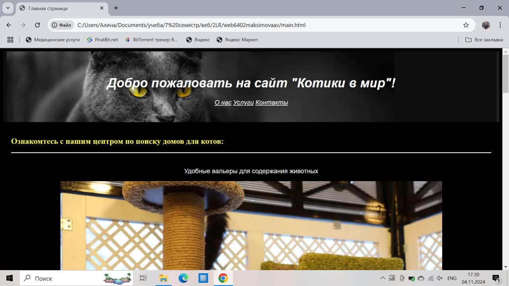
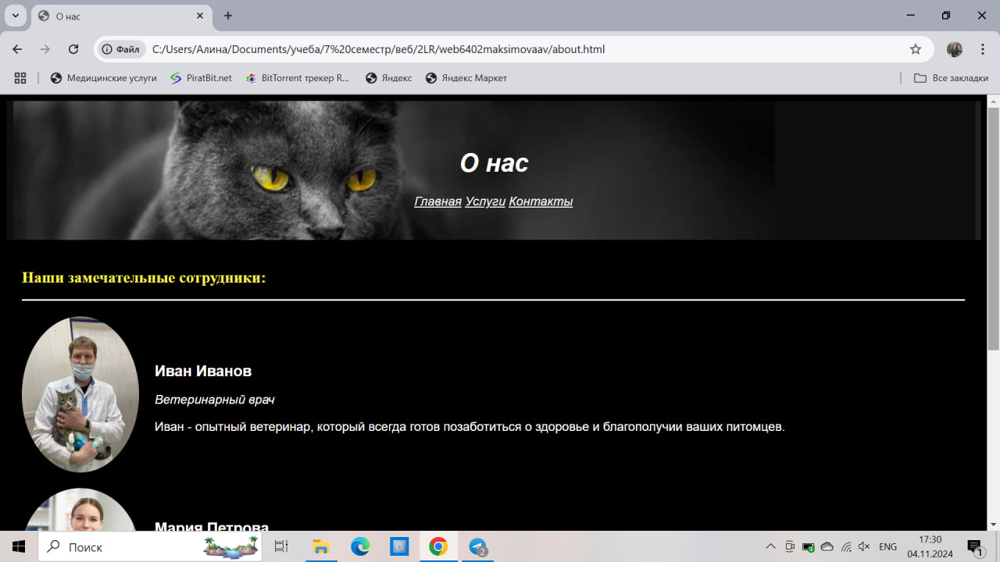
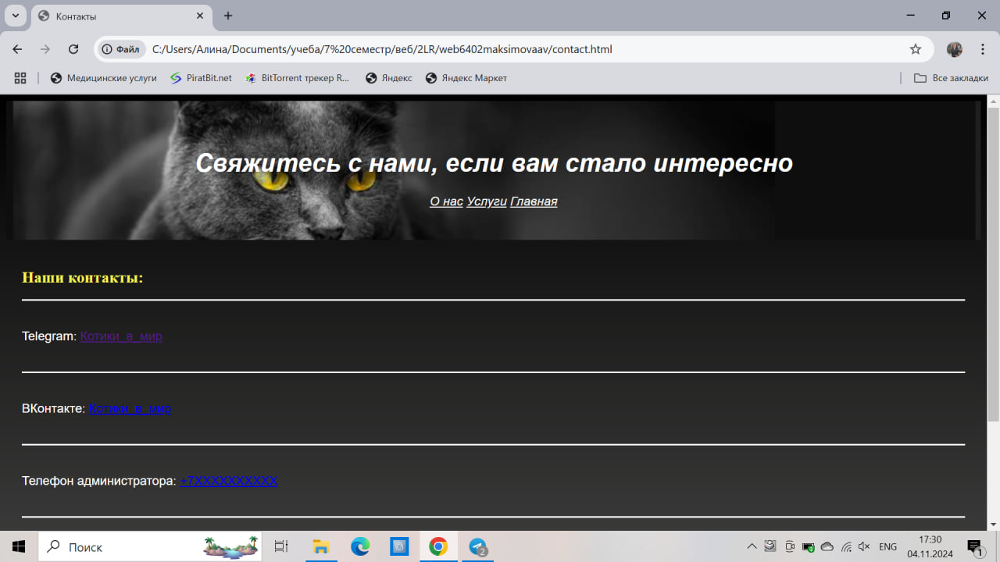
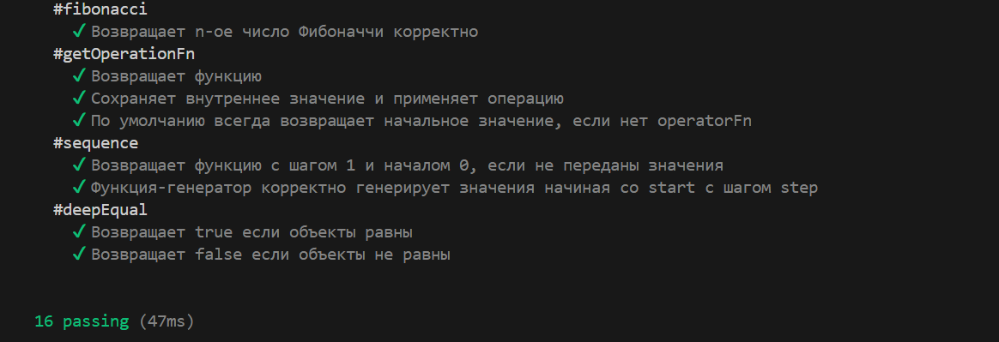

<!DOCTYPE html>
<h1>web6402maksimovaav</h1>
<h1>Лабораторная работа №1</h1>
<h1>Максимова Алина Вадимовна</h1>

Группа: 6402-010302D
   
Научный руководитель: Головашкин Димитрий Львович
   
Предполагаемая тема диплома: Сравнение математических моделей образовательных процессов

<h2>Любимая цитата:</h2>

"Если бы я знал, что умру завтра, я бы не стал писать сегодняшнюю колонку. Но поскольку я знаю, что умру когда-нибудь, то всё равно писать не буду." 
 
© Марк Твен

<h1>Лабораторная работа №2</h1>
<h2>Многостраничный web-сайт на тему "кошачий приют-гостиница" с использованием технологий HTML и CSS.</h2>

Главная страница сайта: 

Cтраница "О нас": 

Страница с контактной информацией: 

Страница с оказываемыми услугами: 

<h1>Лабораторная работа №3</h1>
<h2>Hабор функций на языке JavaScript, реализующиe требуемый функционал.</h2>

Ниже можно наблюдать скрин прохождения тестов написанным набором функций.

<h1>Лабораторная работа №4</h1>
<h2>Цель лабораторной работы: изучение современного CSS, обработки событий на JavaScript и асинхронности.</h2>

В ходе работы были изучены верстка с помощью Flexbox и Grid, анмиация при помощи CSS. Также была изучена работа с сервером, отправкой запросов и обработкой данных.

</html>

