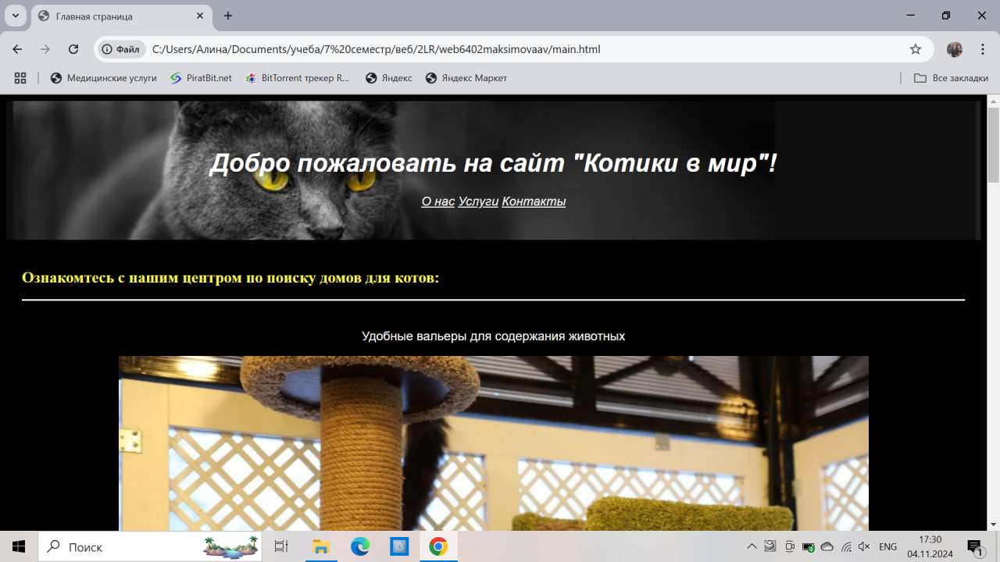
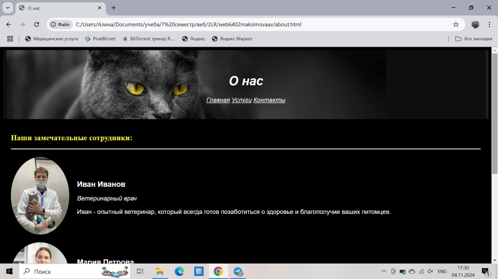
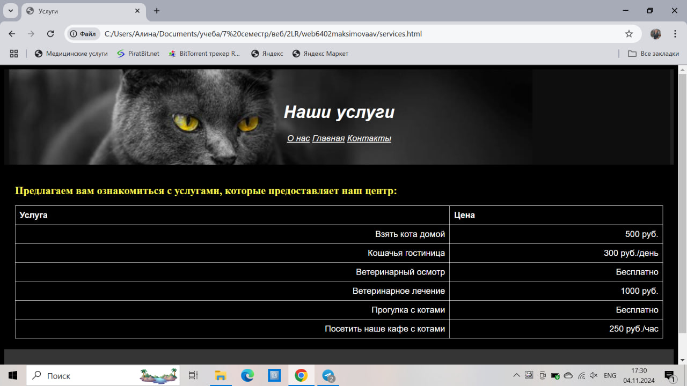

<!DOCTYPE html>
<h1>web6402maksimovaav</h1>
<h1>Лабораторная работа №1</h1>
<h1>Максимова Алина Вадимовна</h1>

Группа: 6402-010302D
   
Научный руководитель: Головашкин Димитрий Львович
   
Предполагаемая тема диплома: Сравнение математических моделей образовательных процессов

<h2>Любимая цитата:</h2>

"Если бы я знал, что умру завтра, я бы не стал писать сегодняшнюю колонку. Но поскольку я знаю, что умру когда-нибудь, то всё равно писать не буду." 
 
© Марк Твен

<h1>Лабораторная работа №2</h1>
<h2>Многостраничный web-сайт на тему "кошачий приют-гостиница" с использованием технологий HTML и CSS.</h2>

Главная страница сайта: 

Cтраница "О нас": 

Страница с контактной информацией: 

Страница с оказываемыми услугами: 

</body>
</html>

